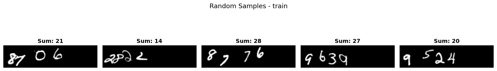
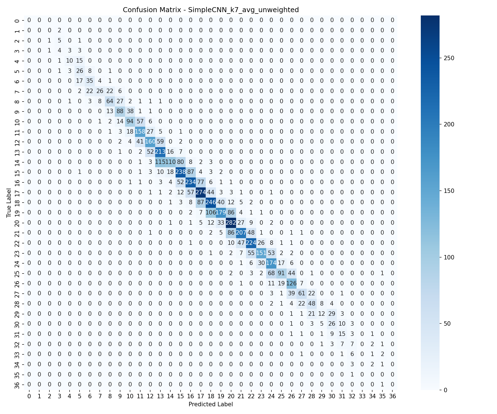
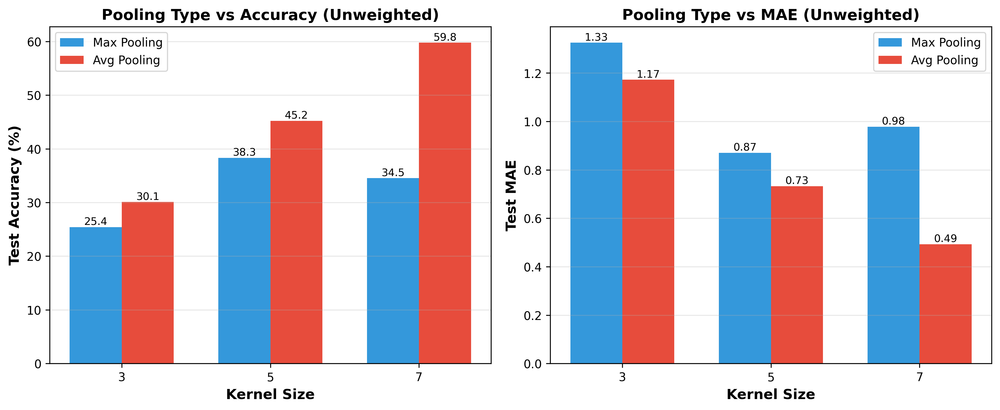
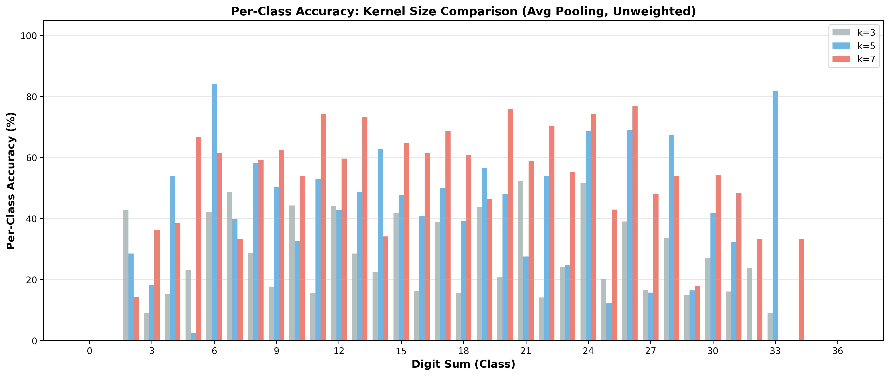
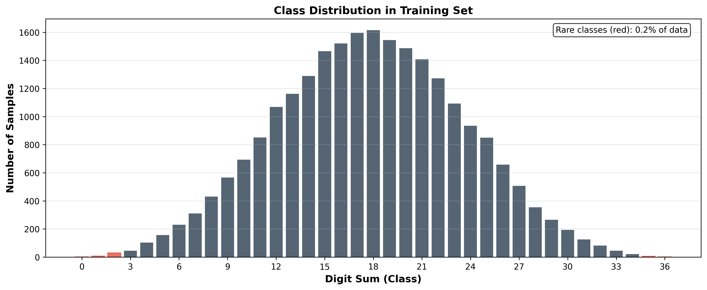
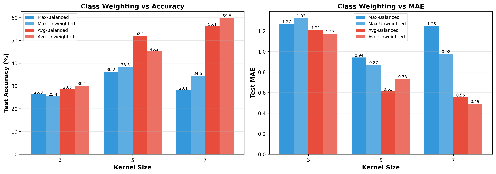
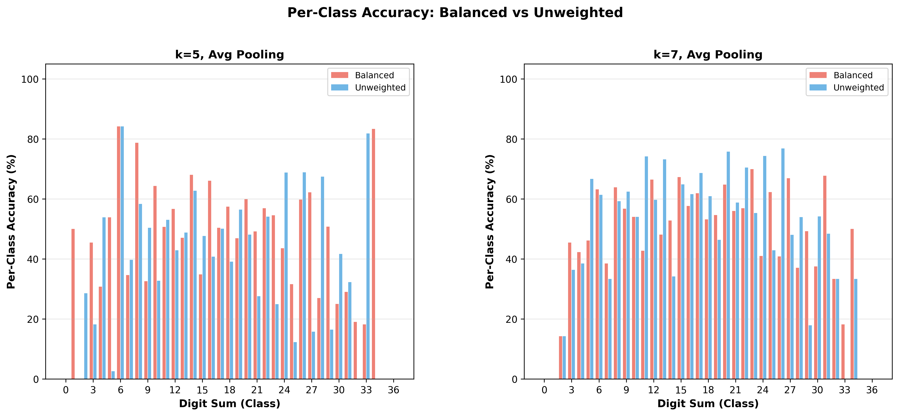

# Digit Sum Prediction

**Goal**: predict the sum of handwritten digits.



Some exploratory data analysis can be found [here](./data/analysis/).

## Baseline

### Results

Performance of different model configurations on the validation set:

| Kernel Size | Pooling | Weighting      | Test Accuracy | Test MAE |
| ----------- | ------- | -------------- | ------------- | -------- |
| 3           | Max     | Balanced       | 26.28%        | 1.27     |
| 3           | Max     | Unweighted     | 25.42%        | 1.33     |
| 3           | Avg     | Balanced       | 28.53%        | 1.21     |
| 3           | Avg     | Unweighted     | 30.08%        | 1.17     |
| 5           | Max     | Balanced       | 36.25%        | 0.94     |
| 5           | Max     | Unweighted     | 38.32%        | 0.87     |
| 5           | Avg     | Balanced       | 52.07%        | 0.61     |
| 5           | Avg     | Unweighted     | 45.22%        | 0.73     |
| 7           | Max     | Balanced       | 28.07%        | 1.25     |
| 7           | Max     | Unweighted     | 34.52%        | 0.98     |
| 7           | Avg     | Balanced       | 56.15%        | 0.56     |
| **7**       | **Avg** | **Unweighted** | **59.77%**    | **0.49** |

**Best Model:** SimpleCNN with kernel size 7, average pooling, and unweighted loss achieves **59.77% accuracy** with **0.49 MAE**.

#### Confusion Matrix (Best Model)



### Key Findings from Ablation Studies

#### Pooling Type



Average pooling consistently outperforms max pooling across metrics. This could be because of the spatial invariance it helps bring about.

#### Kernel Size


For average pooling, the performance seems to improve as we scale kernel size. This provides us with scope for further testing as well (perhaps we should try kernel sizes of 9, 11, etc.).

For max pooling, the performance caps at a kernel size of 5 and degrades as we move to 7.


Somehow, for rarer sums, we see that a kernel size of 5 occasionally out-performs a kernel size of 7.

#### Class Weighting



On performing some exploratory data analysis, we found that the data largely conforms to a Gaussian Distribution. Thus, we tried weighing the classes in a manner inversely proportional to their frequency (capped between 1 and 5) in order to try and boost performance for rarer classes.


Still, the unweighted model seems to perform better.


The "balanced" model still seems to bring about some advantages, though. The rarer classes are better represented (as expected) even though the overall performance degrades. If we choose to optimise for a metric that favours these rarer classes, then this could be a useful approach.

**Final Learnings**:

- we should favour average pooling over max pooling
- A kernel size of 7 seems to bring about the best overall performance, but larger kernel sizes may do even better. Also, a kernel size of 5 seems to do better on rare classes. Thus, a multi-branch CNN should be strongly considered for the final model.

### Usage

#### Data Preprocessing

Split raw data into train/val sets with stratification:

```bash
uv run -m src.pre.process --data_dir data --output_dir data/processed --val_rat 0.2 --seed 42
```

Analyze the processed data (generates visualizations and quality reports):

```bash
uv run -m src.pre.analyse --data_dir data/processed --output_dir data/analysis --seed 42
```

#### Training

Train with default configuration:

```bash
uv run -m src.baseline --mode defaults --balance --pool avg
```

Train with different kernel sizes:

```bash
uv run -m src.baseline --mode kernel --balance --pool avg
```

Sanity check (train and validate on training set):

```bash
uv run -m src.baseline --mode sanity --balance --pool avg
```

#### Evaluation

Evaluate a trained model:

```bash
uv run -m src.baseline --mode eval --kernel 7 --pool avg
```

Evaluate all trained models:

```bash
bash eval_all.sh
```
