# Digit Sum Prediction

**Goal**: predict the sum of handwritten digits.


Some exploratory data analysis can be found [here](./data/analysis/).

## Baseline

### Results

Performance of different model configurations on the validation set:

| Kernel Size | Pooling | Weighting      | Test Accuracy | Test MAE |
| ----------- | ------- | -------------- | ------------- | -------- |
| 3           | Max     | Balanced       | 26.28%        | 1.27     |
| 3           | Max     | Unweighted     | 25.42%        | 1.33     |
| 3           | Avg     | Balanced       | 28.53%        | 1.21     |
| 3           | Avg     | Unweighted     | 30.08%        | 1.17     |
| 5           | Max     | Balanced       | 36.25%        | 0.94     |
| 5           | Max     | Unweighted     | 38.32%        | 0.87     |
| 5           | Avg     | Balanced       | 52.07%        | 0.61     |
| 5           | Avg     | Unweighted     | 45.22%        | 0.73     |
| 7           | Max     | Balanced       | 28.07%        | 1.25     |
| 7           | Max     | Unweighted     | 34.52%        | 0.98     |
| 7           | Avg     | Balanced       | 56.15%        | 0.56     |
| **7**       | **Avg** | **Unweighted** | **59.77%**    | **0.49** |

**Best Model:** SimpleCNN with kernel size 7, average pooling, and unweighted loss achieves **59.77% accuracy** with **0.49 MAE**.

#### Confusion Matrix (Best Model)


#### Training Plots

The plots for all training runs are available on request, with the sample for all average pooling runs shown below:
| Train Loss | Validation Loss | Validation Accuracy |
| ----- | ----- | ----- |
| 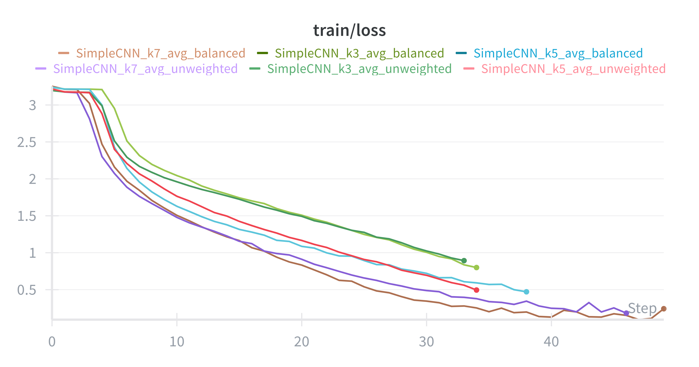 | 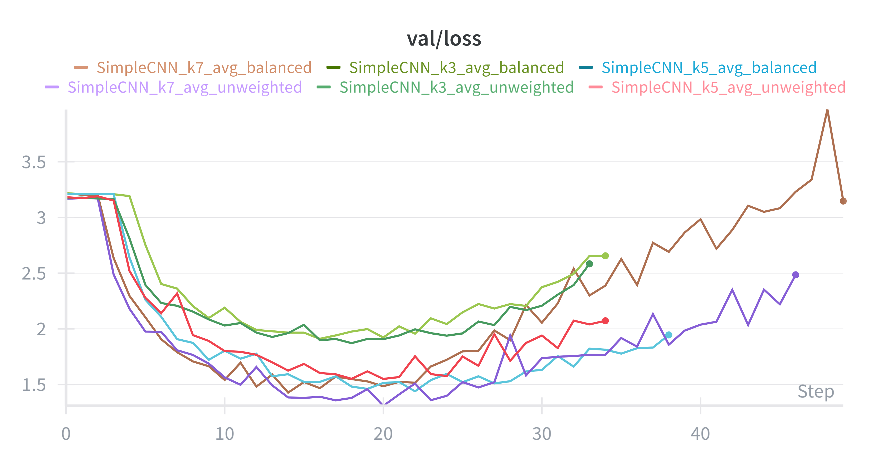 | 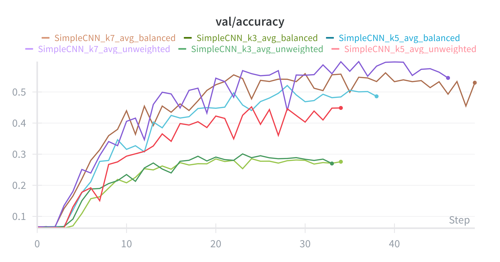 |

### Key Findings from Ablation Studies

#### Pooling Type


Average pooling consistently outperforms max pooling across metrics. This could be because of the spatial invariance it helps bring about.

#### Kernel Size


For average pooling, the performance seems to improve as we scale kernel size. This provides us with scope for further testing as well (perhaps we should try kernel sizes of 9, 11, etc.).

For max pooling, the performance caps at a kernel size of 5 and degrades as we move to 7.


Somehow, for rarer sums, we see that a kernel size of 5 occasionally out-performs a kernel size of 7.

#### Class Weighting


On performing some exploratory data analysis, we found that the data largely conforms to a Gaussian Distribution. Thus, we tried weighing the classes in a manner inversely proportional to their frequency (capped between 1 and 5) in order to try and boost performance for rarer classes.


Still, the unweighted model seems to perform better.


The "balanced" model still seems to bring about some advantages, though. The rarer classes are better represented (as expected) even though the overall performance degrades. If we choose to optimise for a metric that favours these rarer classes, then this could be a useful approach.

**Final Learnings**:

- we should favour average pooling over max pooling
- A kernel size of 7 seems to bring about the best overall performance, but larger kernel sizes may do even better. Also, a kernel size of 5 seems to do better on rare classes. Thus, a multi-branch CNN should be strongly considered for the final model.

### Usage

```bash
uv sync
```

#### Data Preprocessing

Split raw data into train/val sets with stratification:

```bash
uv run -m src.pre.process --data_dir data --output_dir data/processed --val_rat 0.2 --seed 42
```

Analyze the processed data (generates visualizations and quality reports):

```bash
uv run -m src.pre.analyse --data_dir data/processed --output_dir data/analysis --seed 42
```

#### Training

Train with default configuration:

```bash
uv run -m src.baseline --mode defaults --balance --pool avg
```

Train with different kernel sizes:

```bash
uv run -m src.baseline --mode kernel --balance --pool avg
```

Sanity check (train and validate on training set):

```bash
uv run -m src.baseline --mode sanity --balance --pool avg
```

#### Evaluation

Evaluate a trained model:

```bash
uv run -m src.baseline --mode eval --kernel 7 --pool avg
```

Evaluate all trained models:

```bash
bash eval_all.sh
```

NOTE: the checkpoints can be found [here](https://drive.google.com/drive/folders/12NJp2T7JPVG_FaXHWO5_D8R8zth-16D6?usp=sharing)

## Main Model

### Hypothesis 1: The Advantages of Multi-Scale Feature Extraction

Based on the experiences from the Baseline model, which saw better performance for Kernel Size 7, but also better performance of kernel size 5 on rare classes, we decided to build a multi-branch CNN that extracts features at multiple scales to combine the advantages of each kernel size.

However, the results were disappointing, with us barely breaking more than 1% over baseline performance.

> > > some results from this model

### Hypothesis 2: Digit Prediction is Easier than Sum Prediction

Prediction of each digit is fundamentally a much simpler task than prediction of the final sum. But, the labels we've been provided only contain the final sum and not the individual digits.

Thus, we aim to extract digit level labels from our samples.

#### Data Extraction

##### Attempt 1: OCR

Using both `tesseractt` and `easyocr` led to underwhelming results. On extracting digits (with and without colour inversion), we could never break about 50% success, where a successful extraction is one where the sum of predicted digits equals the ground truth sum.

Thus, we had to be more creative.

##### Attempt 2: Pre-trained MNIST + self-labelling

Using digital image processing, we apply the following pipeline to each image:

**Step 1: Contour Detection** - Segment individual digits from the image using OpenCV contour detection.

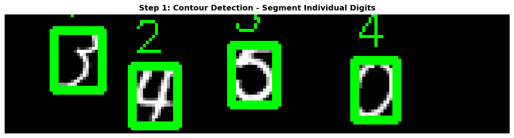

**Step 2: Preprocessing** - For each detected digit:

- Erode with kernel size 2 (thin the strokes to match MNIST style)
- Add padding of 4 pixels (center the digit)
- Resize to 28×28

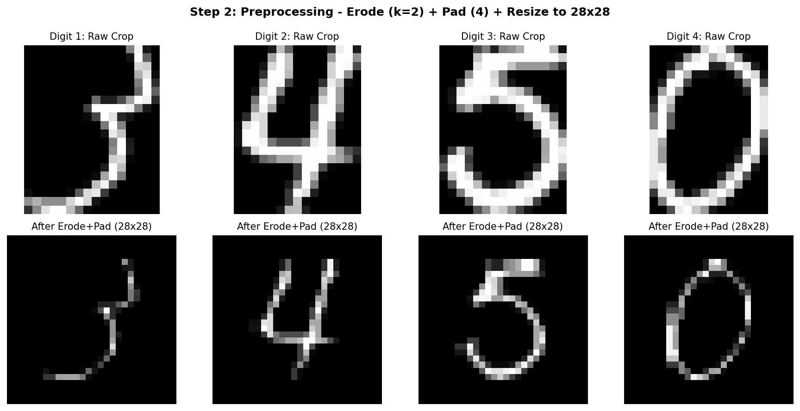

**Step 3: Classification** - Classify each preprocessed digit using a simple CNN pre-trained on MNIST, then sum the predictions and compare with the ground truth sum. If they match, the extraction is considered successful.

**Initial Results:**

- Train set: 12,332 successes (51.4%), 4,562 failures, 7,106 skipped (contour issues)
- Val set: 3,066 successes (51.1%), 1,134 failures, 1,800 skipped

**Manual Labelling + Fine-tuning:**

The pre-trained MNIST model struggled with our handwriting style. To improve it:

1. Manually labelled 500 failure cases using a custom GUI tool

   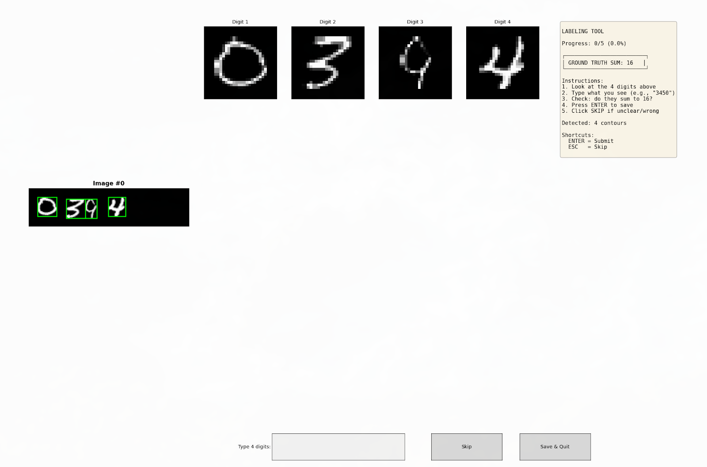

2. Fine-tuned the MNIST classifier on ~51K digit crops (manual labels + pseudo-labels from successes)
3. Re-classified the failure cases with the fine-tuned model → recovered ~3,400 additional samples

This brought our labelled set from 15,398 to 19,313 samples (64.4% coverage).

**Iterative Self-Labelling:**

At this stage, we build our multi-head model and apply iterative self-labelling:

1. Train on available labelled data
2. Attempt to classify remaining unlabelled data
3. For samples where predicted sum matches ground truth, add to labelled set
4. Repeat

**Self-Labelling Rounds:**

| Round | Input Samples | Newly Labelled | Remaining |
| ----- | ------------- | -------------- | --------- |
| 1     | 10,687        | 8,133          | 2,554     |
| 2     | 2,554         | 1,669          | 885       |
| 3     | 885           | 361            | 524       |
| 4     | 524           | 139            | 385       |
| 5     | 385           | 70             | 315       |
| 6     | 315           | 46             | 269       |
| 7     | 269           | 26             | 243       |

After 7 rounds, ~250 samples remained unlabelled. We manually labelled most of these using a custom GUI tool. The final 14 samples were too ambiguous even for human labelling and were kept as unlabelled test samples.

**Final Dataset:** 29,986 labelled samples (99.95% coverage) with per-digit labels.

#### Modelling

Since it is usually adept at feature extraction, we use a ResNet based backbone with some simple dense classification heads.

Immediately, we see a significant boost in performance. With just about a million parameters (half of the best baseline model) we get a test accuracy of about 92.63%.

##### Experiments

###### Deeper and Wider

We add a "width multiplier" that essentially:

- scales the channel dimensions through the backbone
- makes the classification heads two layer MLPs
  Thus, the models are essentially deeper and wider.

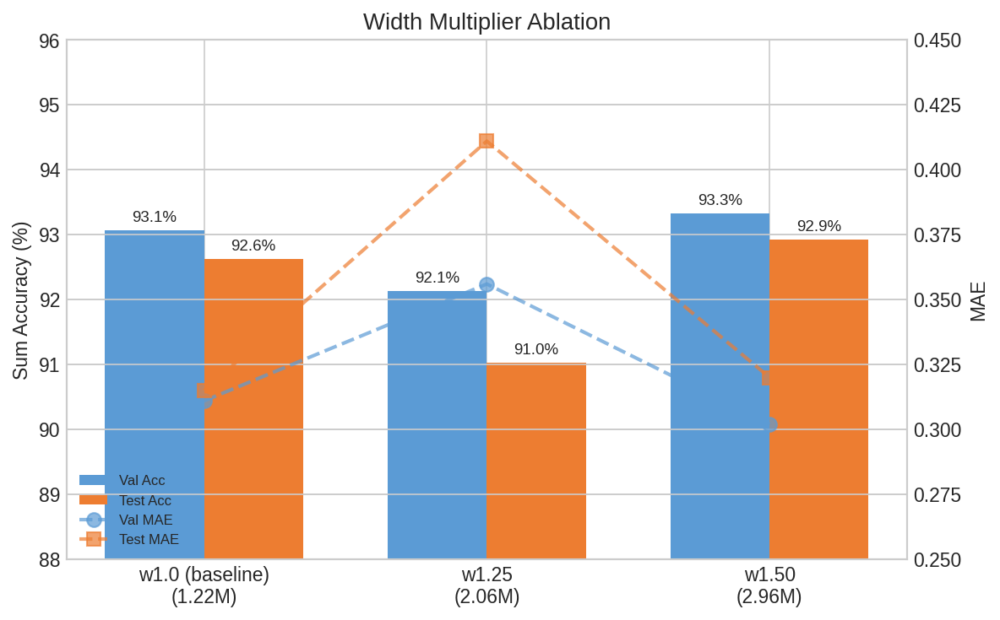

However, we see that this does not aid performance much, suggesting that our initial model is "good enough" for the task at hand.

###### Initial Kernel Sizes

On altering the initial kernel size of the ResNet backbone, we notice:

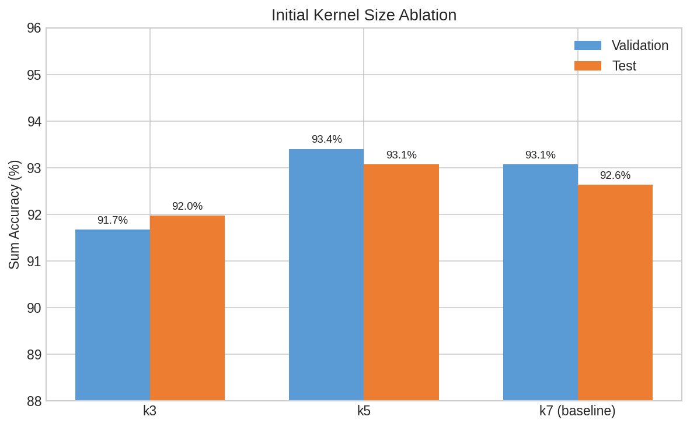

The small kernel sizes severely under-perform. The kernel size of 5 does slightly better on the val set than that of 7, but slightly under-performs on the test set. Since the performance does not scale much with size, we end our experiments here. This is likely because the image samples are such that larger scale features are more important.

###### Regularising Using Total Sum

We hypothesized that adding an auxiliary loss term for the total sum might help the model learn more coherent digit predictions. The sum loss computes a differentiable expected value for each digit (E[digit] = Σ(softmax_prob_i × i)) and applies MSE against the ground truth sum. This encourages digit predictions that are collectively consistent with the known total.

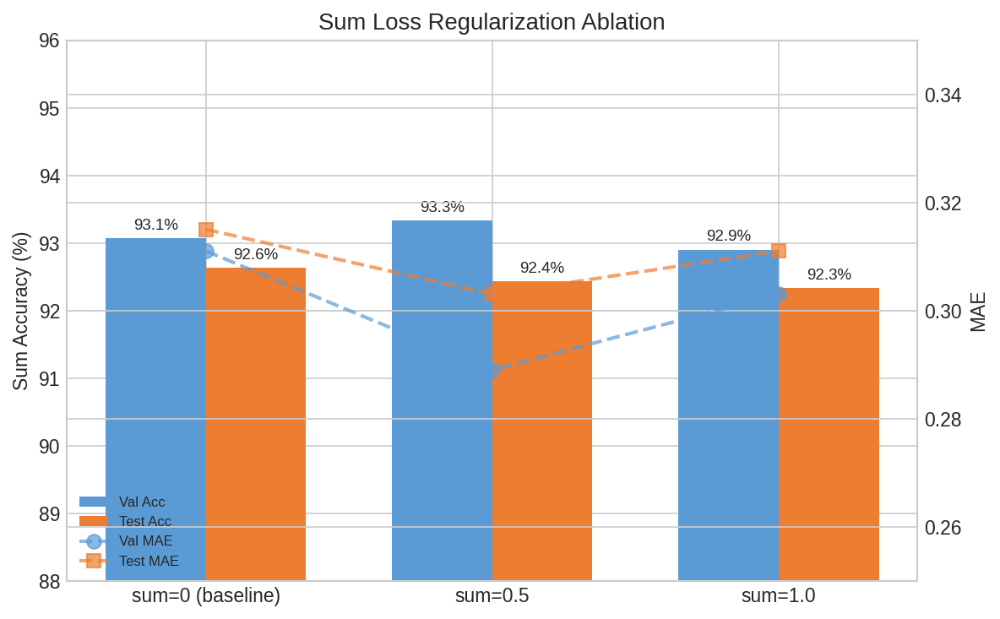

However, as shown above, adding sum regularization (weights 0.5 and 1.0) did not improve performance over the baseline. The individual digit supervision appears sufficient for learning accurate predictions.

Interestingly, there was an improvement in MAE - likely because the model is somewhat encouraged to optimise for the sum as well.

###### Spatial Attention

We explored whether learned spatial attention could outperform global average pooling. The hypothesis was that different digit positions might benefit from focusing on different spatial regions of the feature maps. We implemented per-head spatial attention that learns to weight spatial locations before classification.

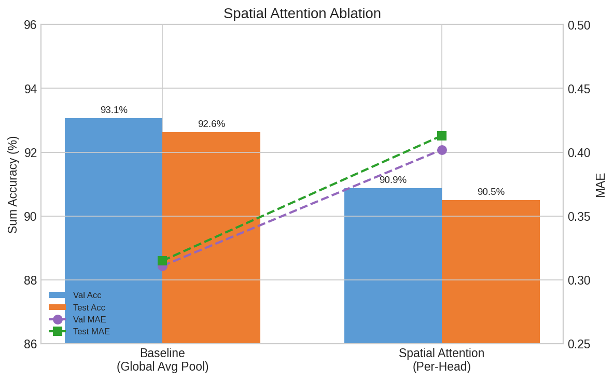

Surprisingly, spatial attention underperformed the baseline by ~2%. Global average pooling's uniform weighting appears to be a better inductive bias for this task, possibly because digits are not uniformly separated and each head needs to attend to the entire feature.

###### Augmentation

We applied standard data augmentation techniques to improve generalization:

- **RandomRotation**: ±5° rotation
- **RandomAffine**: 5% translation
- **GaussianNoise**: σ=0.02
- **RandomErasing**: 10% probability, small patches

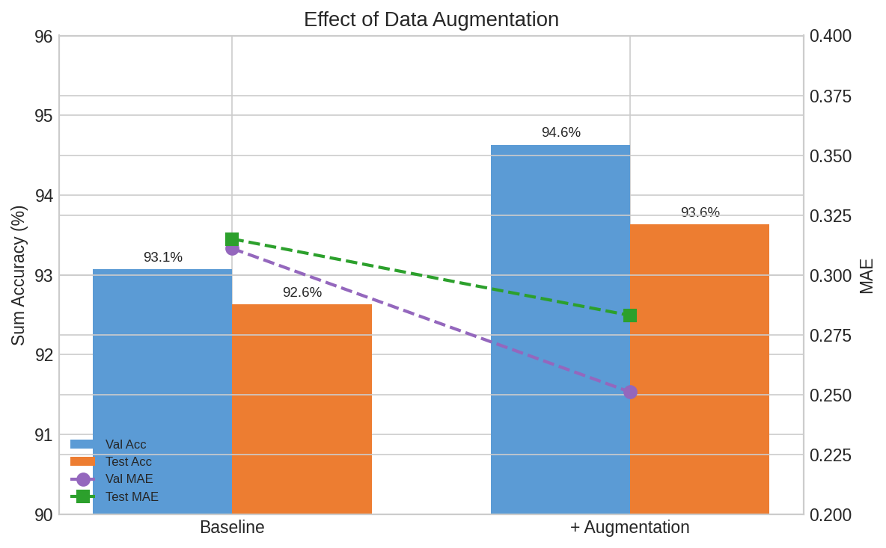

###### Summary

| Config        | Val Sum Acc | Test Sum Acc | Val MAE  | Test MAE | Val Digit Acc | Params |
| ------------- | ----------- | ------------ | -------- | -------- | ------------- | ------ |
| **aug**       | **94.63%**  | **93.63%**   | **0.25** | **0.28** | **97.25%**    | 1.22M  |
| k5            | 93.40%      | 93.07%       | 0.32     | 0.31     | 96.92%        | 1.22M  |
| w1.50         | 93.33%      | 92.93%       | 0.30     | 0.32     | 96.93%        | 2.96M  |
| sum0.5        | 93.33%      | 92.43%       | 0.29     | 0.30     | 96.93%        | 1.22M  |
| baseline (k7) | 93.07%      | 92.63%       | 0.31     | 0.32     | 96.87%        | 1.22M  |
| sum1.0        | 92.90%      | 92.33%       | 0.30     | 0.31     | 96.81%        | 1.22M  |
| w1.25         | 92.13%      | 91.03%       | 0.36     | 0.41     | 96.63%        | 2.06M  |
| k3            | 91.67%      | 91.97%       | 0.39     | 0.35     | 96.50%        | 1.22M  |
| spatial       | 90.87%      | 90.50%       | 0.40     | 0.41     | 96.26%        | 1.22M  |

###### Detailed Analysis

**Test Set Class Distribution**

The test set follows a Gaussian-like distribution centered around sum=17. We define rare classes as the extreme ends (0-5, 31-36) with <40 samples each, and common classes as the middle range (12-24) with 111-229 samples each.

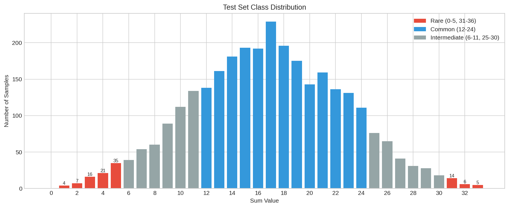

**Rare vs Common Class Performance**

Analyzing per-class accuracy reveals that some configurations handle class imbalance better than others. Notably, `sum1.0` and `k3` actually perform _better_ on rare classes, while `aug` achieves perfect balance with the highest overall accuracy.

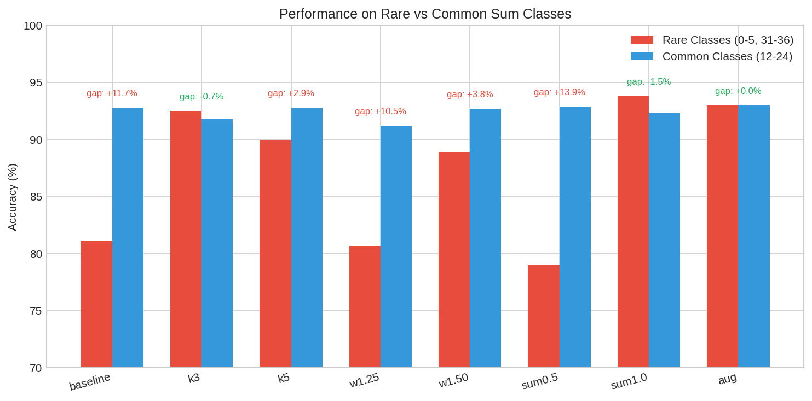

**Per-Digit Position Accuracy**

Digit 3 (third position) is consistently the hardest to classify across all configurations (96.10% avg ± 0.51%), while Digits 1 and 4 are easiest (97.23% avg). This may be due to middle digits being harder to segment or having more overlap with neighbors.

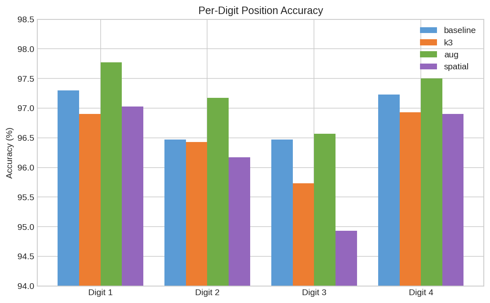

# TODO

- [x] push to gh classroom
- [x] put screen-shot of GUI tool
- [ ] train on all labelled data
- [ ] clean up and un-gpt
- [ ] remove test OCR models from uv
